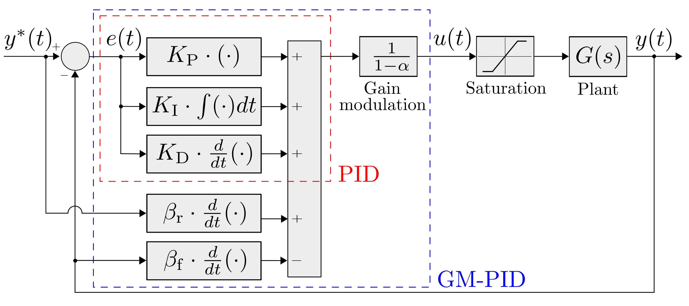
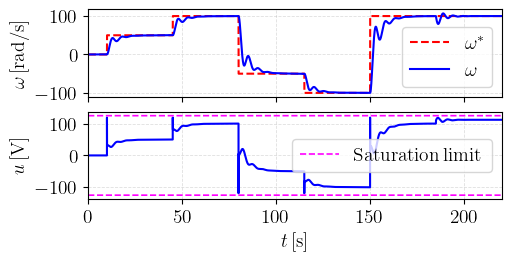
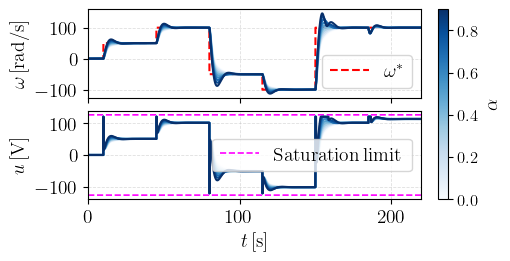
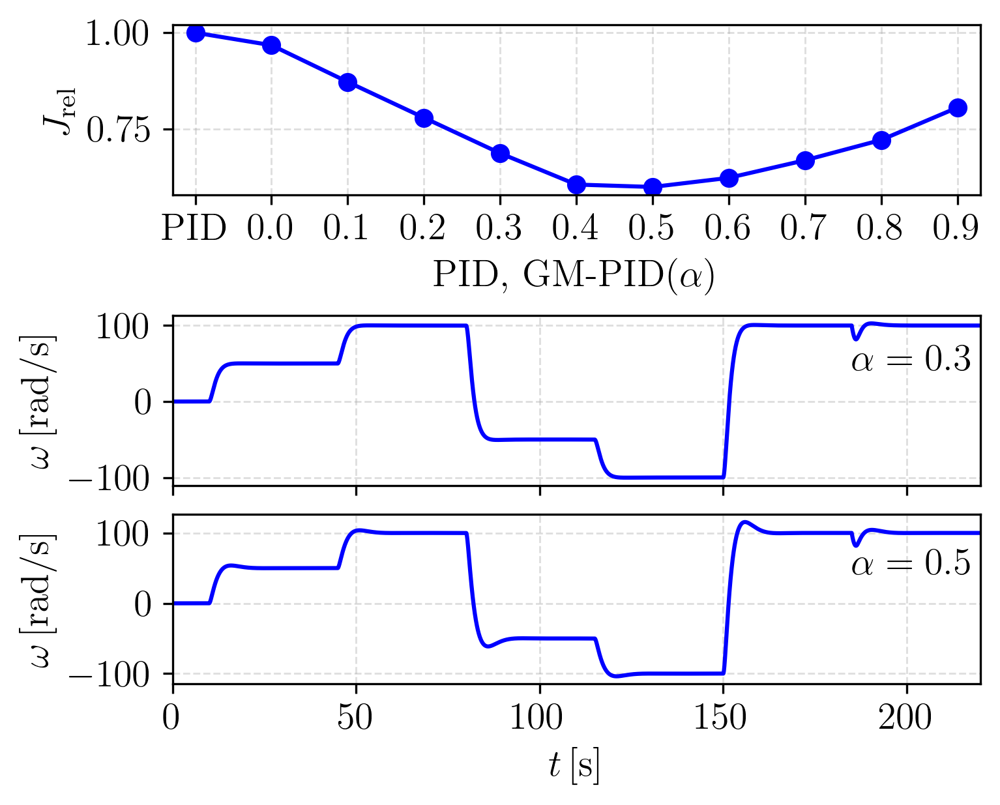
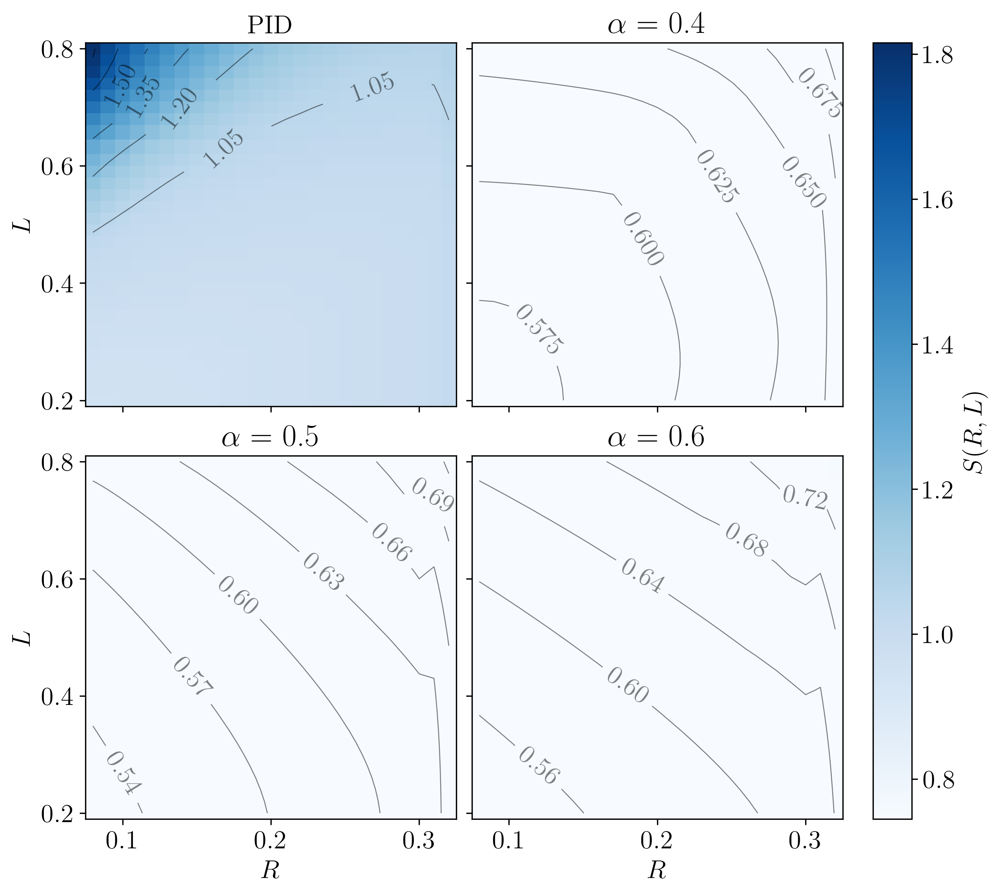
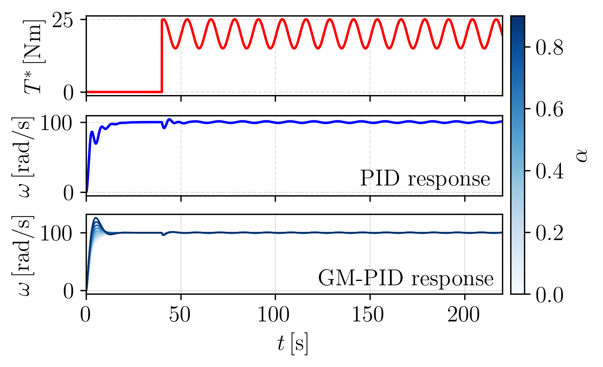
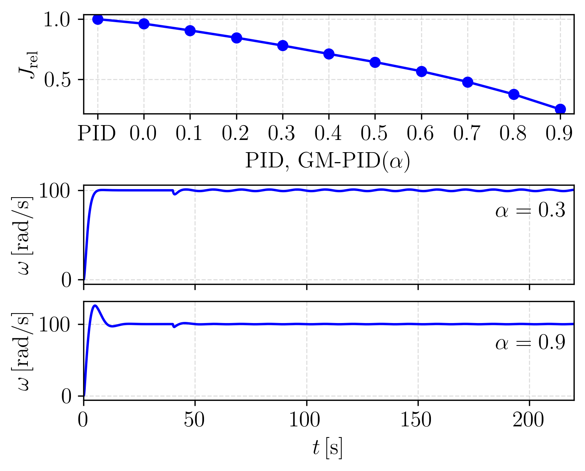

# Gain-Modulated PID Control for Robust Performance Under Parametric Uncertainty

## Note: The manuscript associated with this project is currently under review at CDC 2026.

<p align="center">
  <b>Block diagram of the proposed GM-PID controller.</b><br>
  
</p>

This work introduces a framework for shaping closed-loop sensitivity under parametric uncertainty without explicit disturbance estimation, by embedding unknown effects into the control law through a gain-modulated mechanism.  

This repository contains the code, data, and methods used to implement the GM-PID controller.

---

## Project Structure

- The `Libraries` folder contains custom modules for system modeling, parameter estimation, and GM-PID design.

- `nom_tracking.py` – Evaluates nominal tracking under steady load, including tracking performance, control input, and performance index for both classical PID and GM-PID.

- `sen_analysis.py` – Performs parametric sensitivity analysis under variations in armature resistance and inductance.

- `sin_loadtorque.py` – Evaluates disturbance rejection under sinusoidal load torque.

---

## Requirements

- control==0.10.1
- matplotlib==3.10.8
- numpy==2.4.2
- pandas==3.0.1
- scipy==1.17.1

Install dependencies using:

```bash
pip install -r requirements.txt
```
---

Download or clone the repository:

```bash
git clone https://github.com/NyiNyi-14/GM-PID.git
```

Make sure all scripts are in the same directory. 

---

## Results

<p align="center">
  <br>
Speed tracking and control input response of the classical PID controller under the step reference profile. The actuator saturation limits are indicated for reference. <br>
</p>

<p align="center">
  <br>
 Parametric response of the GM-PID controller under different modulation factors α. The color bar represents the value of α, illustrating its influence on transient and steady-state behavior.<br>
</p>

<p align="center">
  <br>
  (Top) Normalized performance index for J_rel for PID and GM-PID values<br>
  (Bottom) GM-PID responses for α = 0.3 and α = 0.5 <br>
</p>

<p align="center">
  <br>
</p>
Sensitivity score of the PID and GM-PID controllers over the (R,L) uncertainty domain. The GM-PID results for α = 0.4, 0.5, and 0.6 are shown as representative cases.<br>
</p>

<p align="center">
  <br>
  Dynamic load torque profile and speed responses of PID and GM-PID under a sinusoidal load disturbance applied at t = 40s. <br>
</p>

<p align="center">
  <br>
  (Top) Performance index J_rel for PID and GM-PID across tested α values. (Bottom) Representative GM-PID responses for α = 0.3 and α = 0.9. <br>
</p>
---

## Related Work

This work revisits the ultra-local model of iPID and reformulates it as a gain-modulated PID framework for sensitivity shaping and robustness improvement.

	•	Robust control
	•	Sensitivity analysis

---

## Citation

To be updated upon publication:

```bibtex

```
---
